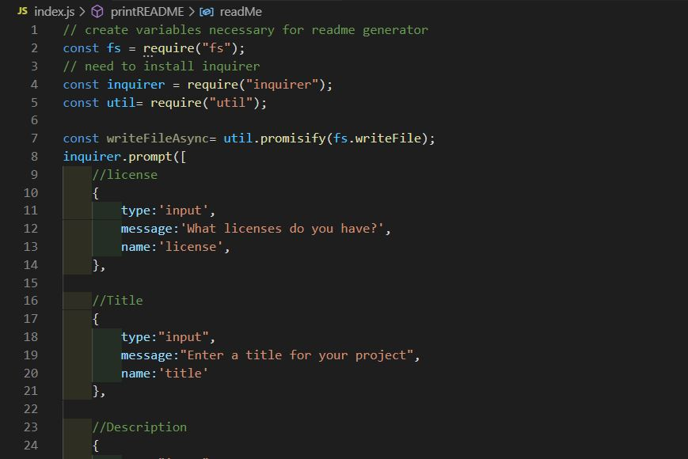
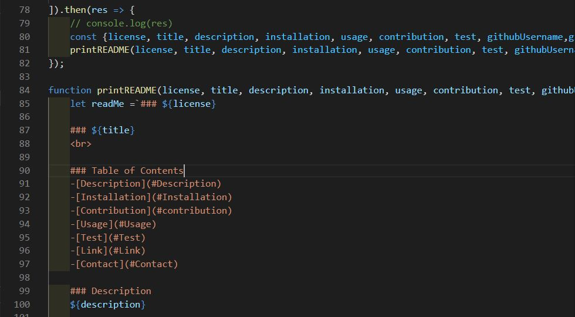
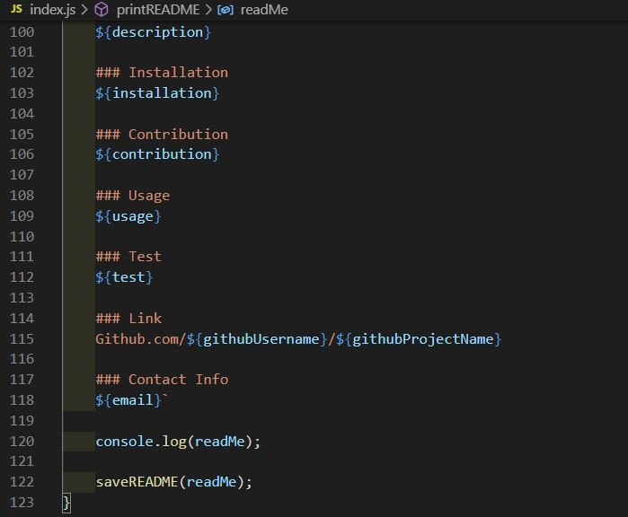

# README Generator

### Deployed Application 

[Video of README Generator]()

### Description 
This application allows users to generate a professional README.md file using the command line.

Before creating the file, npm inquirer must be installed. Then, the user will enter 'node index.js' into the command line. This command will then prompt a series of prompts that are based on the recommended features of a professional README file. After all the appropriate prompts have been answered, the input wil be used to generate the read me file. 

### Features
* Uses node.js to dynamically generate README.md. 
* JavaScript   
* Utilizes Inquirer to capture user inputs 

### Credit
Alejandra Reyes
* areye022@gmail.com
* [GitHub](https://github.com/areye022)
* [LinkedIn](https://www.linkedin.com/in/alejandrareyes022/)

### License
Licensed under [MIT License](./LICENSE)
